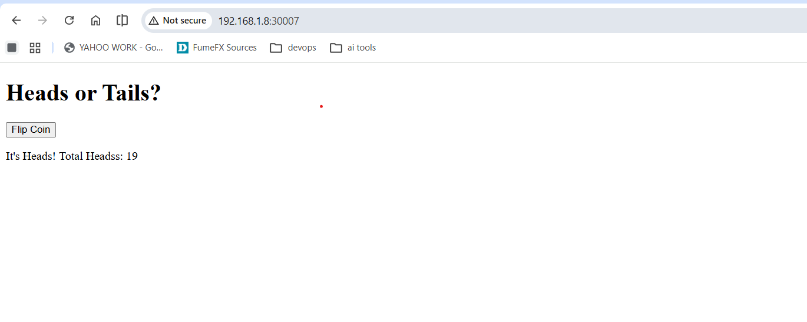
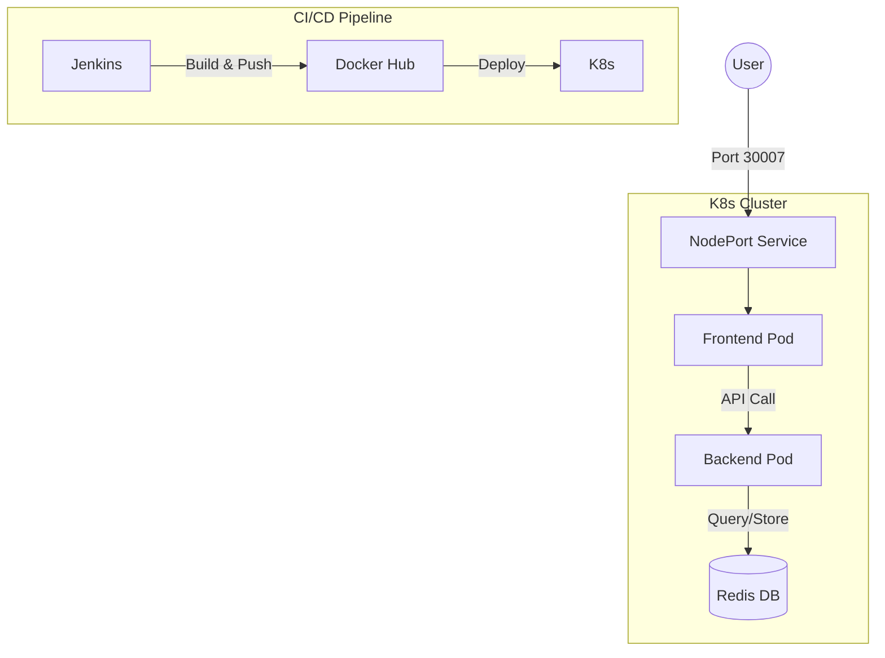

# 🪙 Coin Flip Application

## 🚀 Project Overview
A full-stack, containerized web application deployed on **Kubernetes**. This project simulates a microservices environment where a frontend communicates with a backend API, backed by a Redis database.

## 🛠️ Tech Stack
* **Frontend:** Node.js / HTML / CSS
* **Backend:** Node.js / Express (Logic & API)
* **Database:** Redis (Persistent tally storage)
* **Orchestration:** Kubernetes (K8s)
* **CI/CD:** Jenkins & Docker

## 🏗️ Architecture & Implementation
* **Dockerized Services:** Multi-stage builds for optimized image sizes.
* **Kubernetes Deployments:** Manages pod replicas, ensuring high availability and self-healing.
* **Service Discovery:** * **ClusterIP:** Used for secure, internal-only communication between Backend and Redis.
    * **NodePort:** Exposes the Frontend on port 30007 for external access.

## 🔄 CI/CD Pipeline
This project uses a **Jenkins Declarative Pipeline** to automate the entire lifecycle:
1. **Source:** Detects commits in the GitHub repository.
2. **Build:** Creates Docker images for both Frontend and Backend services.
3. **Push:** Versions and pushes images to Docker Hub.
4. **Deploy:** Automatically updates the K8s cluster with the latest images.

## 🔧 How to Run
1. **Apply Manifests:** `kubectl apply -f k8s-spec/`
2. **Access App:** Open `http://<Node-IP>:30007`

## 💡 Key Challenges Solved
* **Internal DNS:** Used Kubernetes Services to allow the Frontend to find the Backend without hardcoding IP addresses.
* **Automation:** Eliminated manual deployments by implementing Pipeline-as-Code with a `Jenkinsfile`.
