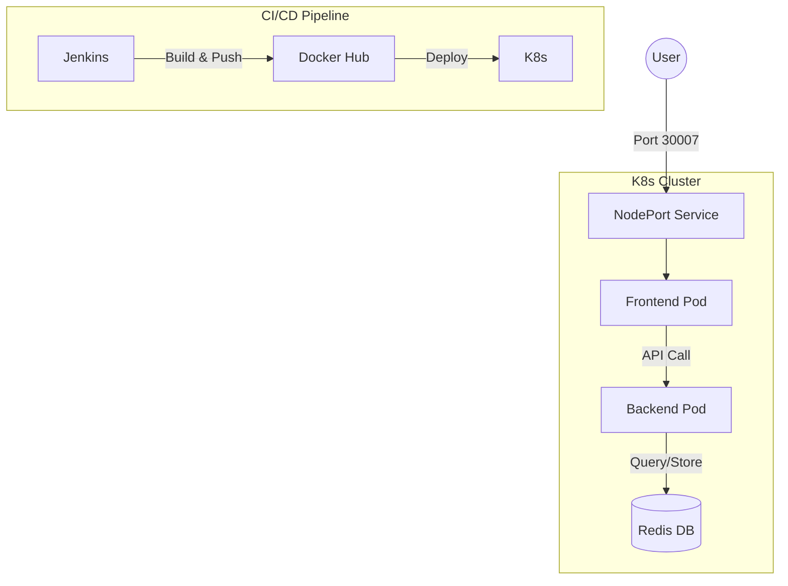

# 🪙 Coin Flip Application

## 🚀 Project Overview
A full-stack, containerized web application deployed on **Kubernetes**. 

## 🛠️ Tech Stack
* **Frontend:** Node.js / HTML / CSS
* **Backend:** Node.js / Express
* **Database:** Redis
* **Orchestration:** Kubernetes
* **CI/CD:** Jenkins
